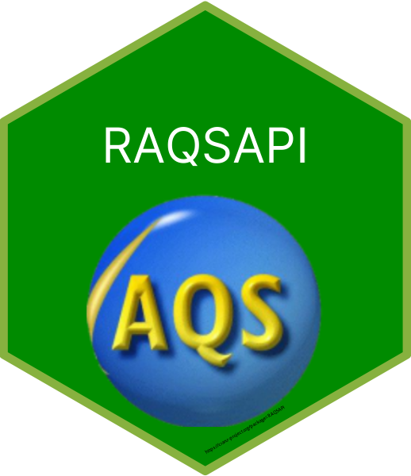

```{r SETUP, echo = FALSE, message = FALSE, warning = FALSE}
knitr::opts_chunk$set(
  collapse = TRUE,
  comment = "#>",
  tidy.ops = list(width.cutoff = 125),
  tidy = TRUE
)
```


<!-- badges: start -->
[](
https://www.repostatus.org/#active)
[](
https://github.com/USEPA/RAQSAPI/actions)
[](
https://CRAN.R-project.org/package=RAQSAPI)
[](
https://cran.r-project.org/package=RAQSAPI)
[](
https://lifecycle.r-lib.org/articles/stages.html)
[](
https://choosealicense.com/licenses/mit/)
[)`-yellowgreen.svg)](/commits/master)
[](https://github.com/USEpa/\
/RAQSAPI/.github/workflows/pkgcheck.yaml)
[](
https://github.com/ropensci/software-review/issues/744)
<!-- badges: end -->

```{r child = "./vignettes/includes/EPA_Disclaimer.Rmd", echo = FALSE, comment = NA}
```

```{r child = "./vignettes/includes/Intro.Rmd"}
```

```{r child = "./vignettes/includes/TimelinessofAQSData.Rmd"}
```

```{r child = "./vignettes/includes/InstallandSetup.Rmd", echo = FALSE, comment = NA}
```

```{r child = "./vignettes/includes/UsingRAQSAPI.Rmd"}
```

```{r child = "./vignettes/includes/RAQSAPIFunctions-Brief.Rmd"}
```

```{r child = "./vignettes/includes/RAQSAPIinaction.Rmd"}
```

```{r child = "./vignettes/includes/pyaqsapi.Rmd"}
```

```{r child = "./vignettes/includes/Acknowledgements.Rmd"}
```

# References
